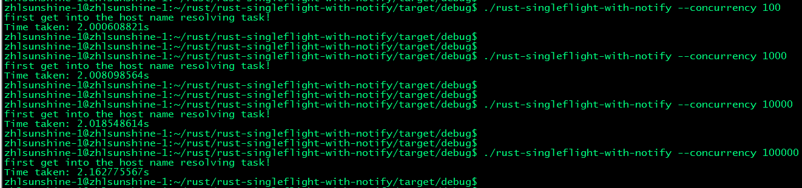

# Rust example for SingleFlight pattern
This Rust example is for SingleFlight pattern implementation based on Rust `tokio::sync::Notify` lib.

## File Description

- `rust-singleflight-with-notify` is the binary of this example
- `--concurrency` is the option of concurrency number

## Binary build

```bash
$ cd rust-singleflight-with-notify
$ cargo build
$ cd target/debug
$ ./rust-singleflight-with-notify --concurrency 100
first get into the host name resolving task!
Time taken: 2.000608821s
```

## Test Result

